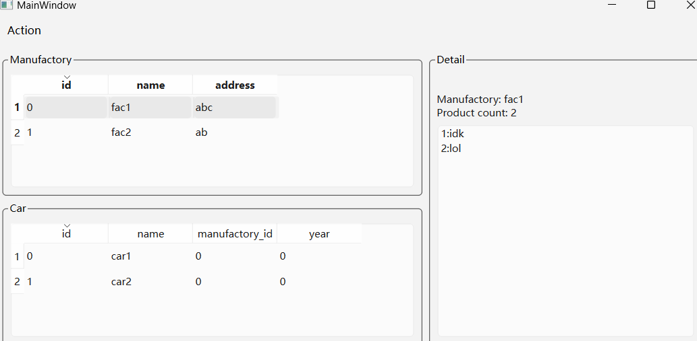
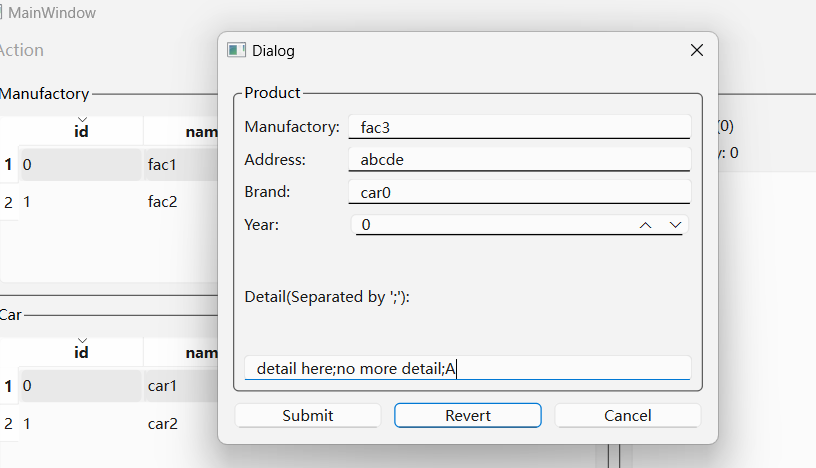
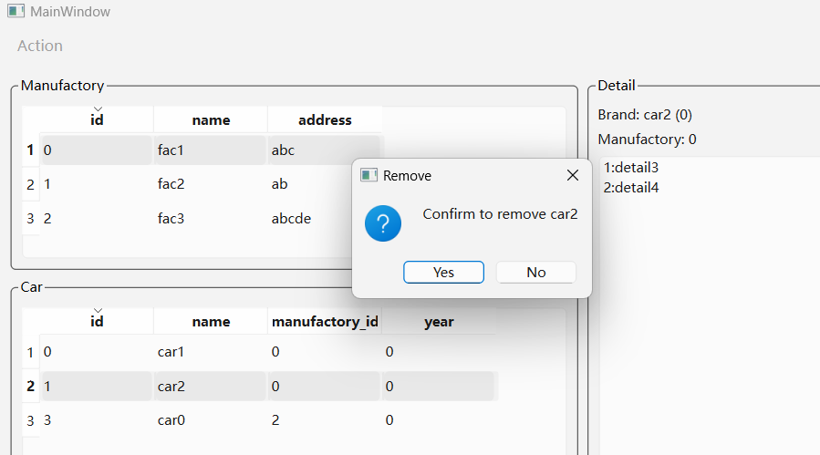

#### CH1302 QT操作主从视图及XML

程序概述：
先连接数据库，并创建两张表manufactories和cars，其中表cars中有一个外键指向表manufactories。
程序主界面的两个QTableView分别对应两张表，选中一个manufactories表项可以在cars表中列出对应的项
还有一个QListWidget，独立于数据库，从XML中读取数据。

主界面菜单栏可以简单地添加和删除表项。

注：
* 没有写初始化XML的相关代码，需要手动复制一份data.xml到可执行文件目录下
* 仅测试了SQLITE，其他的数据库是UI设计时的摆设

程序效果：

