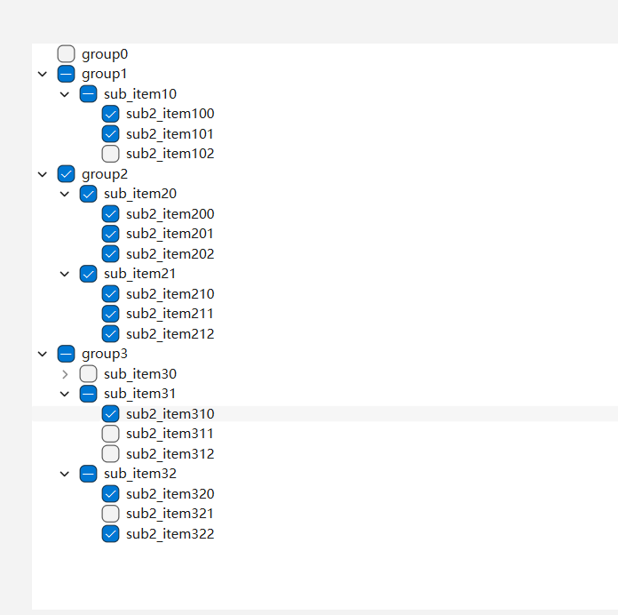

#### CH209 创建具有复选框的树形控件

注:
* 若控件顶部中多出一个'1'，是因为QTreeWidget有Header相关属性，根据需要调整
* 若使用信号
`QTreeWidget::itemChanged(QTreeWidgetItem*,int)`
会导致在代码中setCheckState时也触发信号，导致父子之间多重递归，因此使用了
`QTreeWidget::itemClicked(QTreeWidgetItem*,int)`
且没有设置Flag
`Qt::ItemIsUserCheckable`

示例过程：
在设计界面拖拽一个QTreeWidget，在代码中添加三级Item，编写信号槽。

程序效果：

