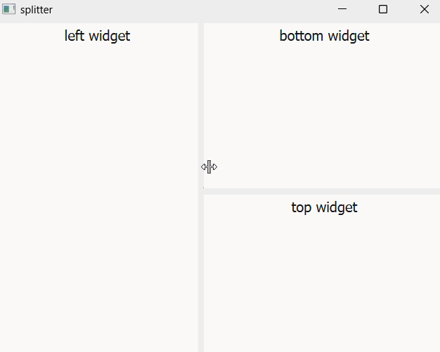

#### CH301 使用QSplitter类窗口分割，用户拖拽改变尺寸

注：
* `QSplitter::setStretchFactor(int index,int stretch)`
用于设置index号控件占位的权值，只设置一个控件时无效，依然均分
* `QSplitter::setOpaqueResize(bool opaque)`
用于设置实时更新还是拖动结束时更新

示例过程：
创建主QSplitter对象，再创建两个子QSplitter对象，创建三个QTextEdit，一左两右，设置相关属性。

程序效果：
