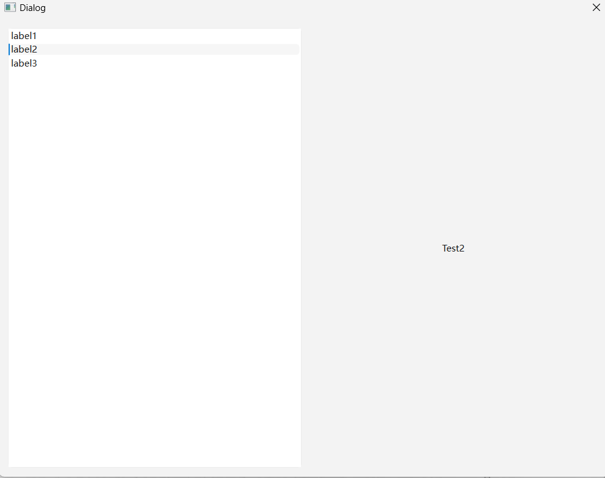

#### CH303 配合QListWidget使用QStackedWidget类

示例过程：
创建QListWidget和QStackedWidget，分别向两个类的对象中加入QListWidgetItem和QLabel，连接信号与槽。
`void QListWidget::currentRowChanged(int currentRow)`
`void QStackedWidget::setCurrentIndex(int index)`

程序效果：
