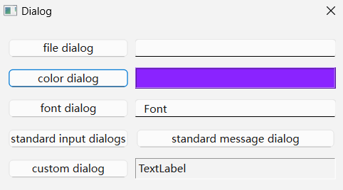
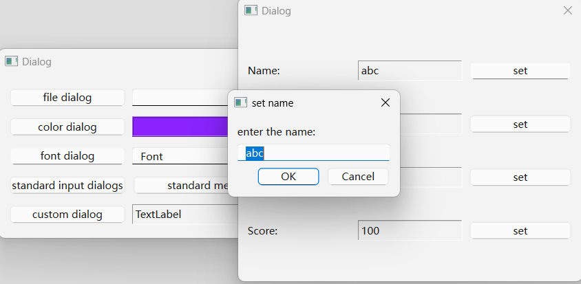
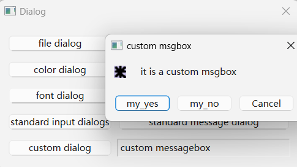

#### CH401 学习基本对话框的使用

注：
* 可能会出现
`setGeometry: Unable to set geometry ......`
可通过不调用对应对话框类的静态成员函数，而是创建临时对象，再adjustSize()或者设置其他相关属性来解决。

示例过程：
利用Designer放置各个控件，布局
编写按钮槽函数弹出对应对话框
分别是
```
QFileDialog
QColorDialog
QFontDialog
QInputDialog
QMessageBox
QDialog(自定义用)
```

程序效果：


