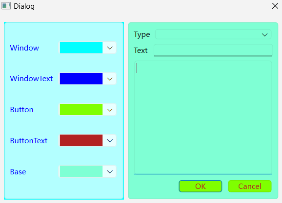

#### CH404 学习使用QPalette改变控件颜色

注：
* 设置QPalette时先获得原控件的QPalette再修改获得的临时QPalette然后设置回去，以免丢失原有其他属性
* 也可以为QPalette设置QBrush来显示图片作为背景等
* 设置颜色的函数有另外两个参数
`void QPalette::setColor(QPalette::ColorGroup group, QPalette::ColorRole role, const QColor &color)`
`void QPalette::setColor(QPalette::ColorRole role, const QColor &color)`
* QColorGroup为控件所处状态，分获得焦点，失去焦点，不可用
* QColorRole为要适用的类别，如背景，文本，按钮

示例过程：
在Designer中拖拽各控件与布局，转到开始QComboBox的槽，给相应的控件设置QPalette

程序效果：
