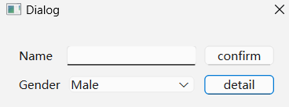
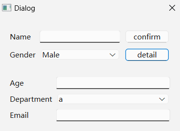

#### CH406 实现可拓展对话框

注：
* 可能会出现
`setGeometry: Unable to set geometry ......`
可通过show()之前adjustSize()或者设置其他相关属性来解决。
* 需要对整个对话框的布局设置
`QLayout::setSizeConstraint(QLayout::SetFixedSize)`
否则基本信息窗口中的控件会因为详细信息窗口的隐藏而自动拉伸，占满窗口，而不是缩小窗口

示例过程：
分别创建基础信息与详细信息的QWidget，通过按钮槽函数改变详细信息控件的显示与隐藏

程序效果：

