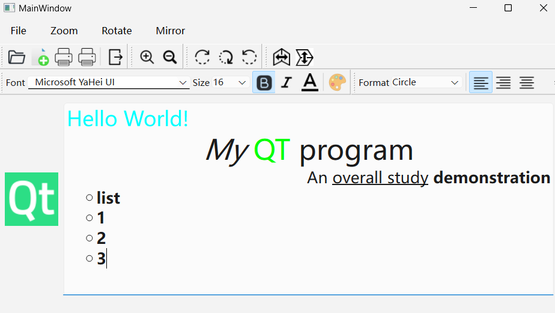

#### CH501 实现基本文本编辑功能与图片编辑功能

注：
* 图片来源网络
* 打印机需要PrintSupport模块

#####示例内容：
**图片相关**：
* 载入图片并显示
* 放大缩小，旋转，反转
* 调用打印机打印图片

**文本相关**：
* 载入文本文件并显示
* 复制剪切粘贴，撤销重做以及快捷键
* 调整字体，大小，加粗斜体下划线，颜色，对齐以及快捷格式排序
* 调用打印机打印文本

程序效果：
