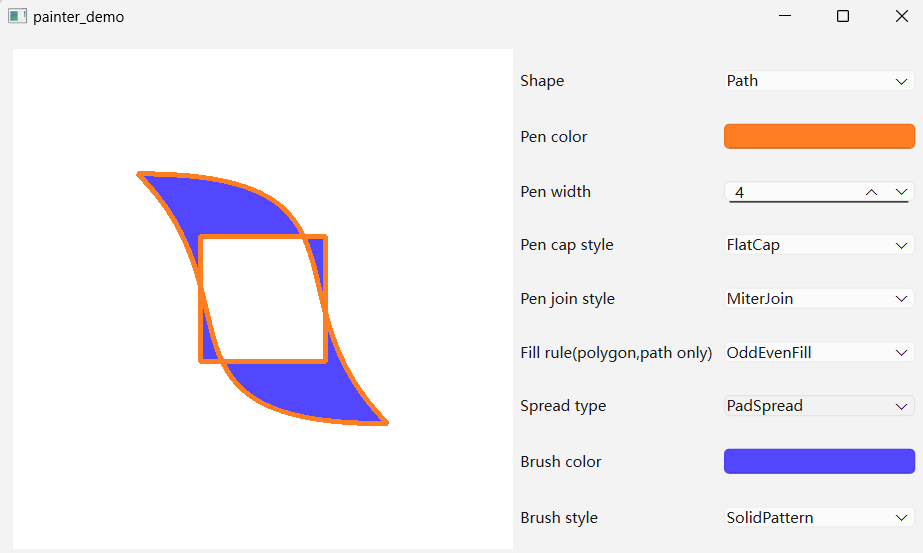
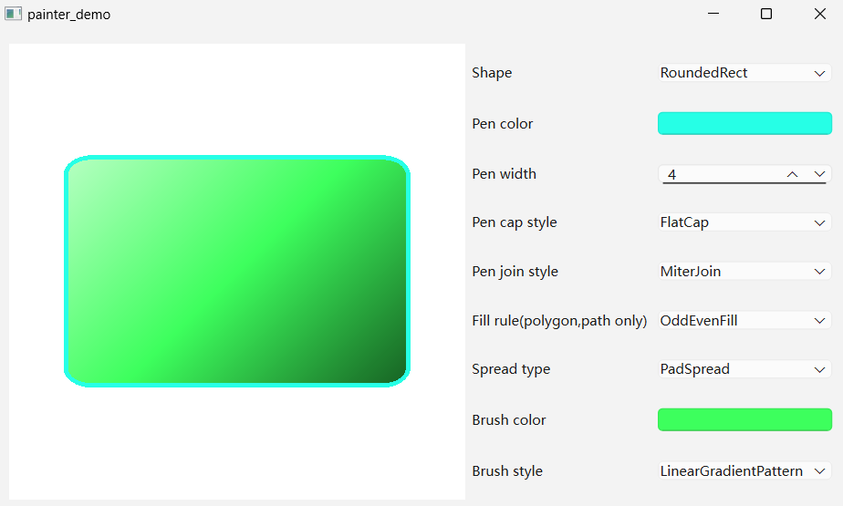

#### CH602 基础图形的绘制

注：
* BrushStyle中的XXXGradientPatern需要与QGradient类的派生类配合使用，QBrush的构造函数中可以传入一个QGradient对象
* 图形的具体绘制坐标，尺寸等参数在程序内写死了，仅用于学习如何调用相关函数

#####示例内容：
QPen的颜色(color)，宽度(width)，顶帽类型(capStyle)，连接点类型(joinStyle)
QBrush的颜色(color)，填充规则(fillRule)，类型(style)，以及配合渐变类QGradient的使用

程序效果：

