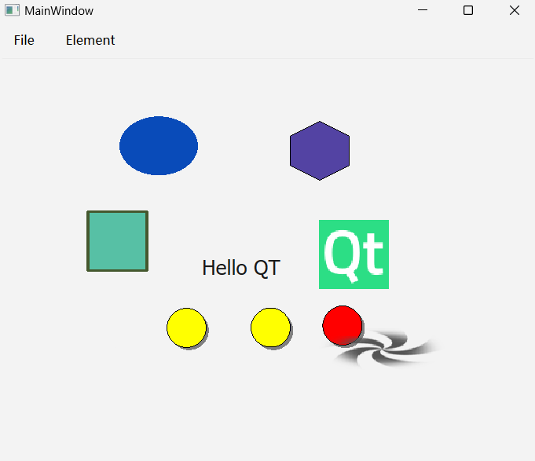

#### CH703 学习使用QGraphicsScene和预定义与自定义的QGraphicsItem

注：
* 图片随便弄的

#####示例内容：
QGraphicsScene中加入预定义的各种QGraphicsView，包括椭圆，多边形，矩形，文本，图片
自定义QGraphicsView，利用QGraphicsItemAnimation实现运动（也可以如CH701使用定时器）

程序效果：
