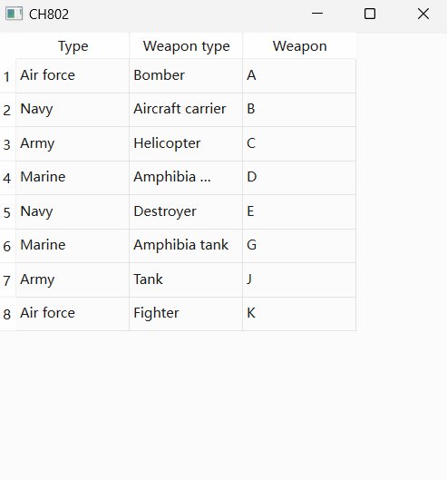

#### CH802 自定义一个QAbstractTableModel派生类

示例过程：
定义一个QAbstractTableModel派生类
重写如下函数：
```
    int rowCount(const QModelIndex &parent=QModelIndex()) const;
    int columnCount(const QModelIndex &parent=QModelIndex()) const;
    QVariant data(const QModelIndex &index,int role) const;
    QVariant headerData(int section,Qt::Orientation orientation,int role) const;
```

程序效果：
